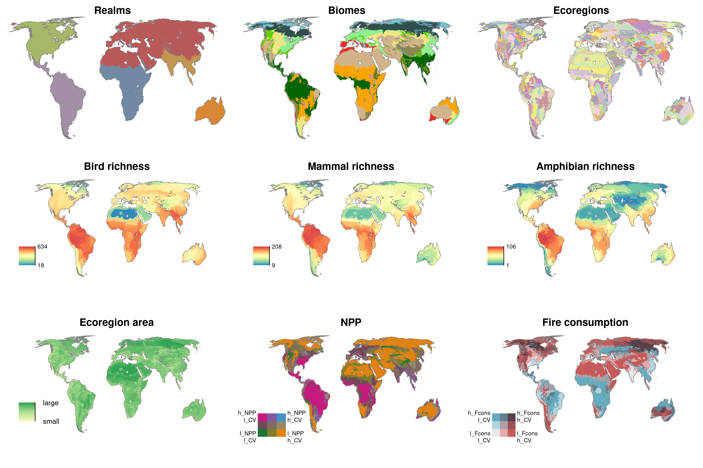
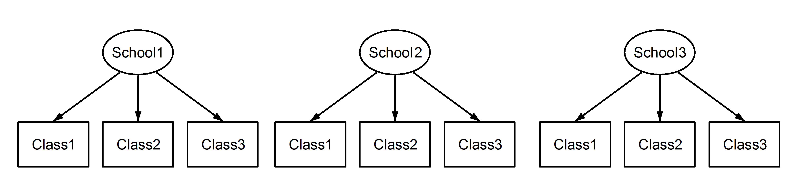
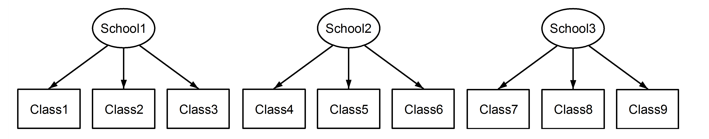
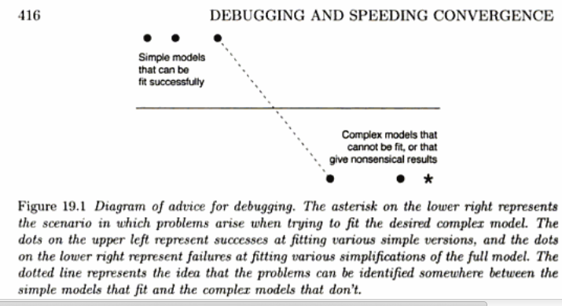
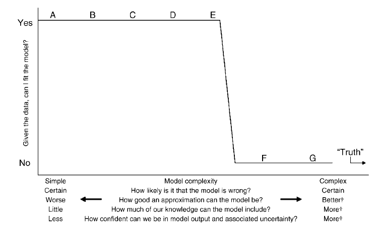
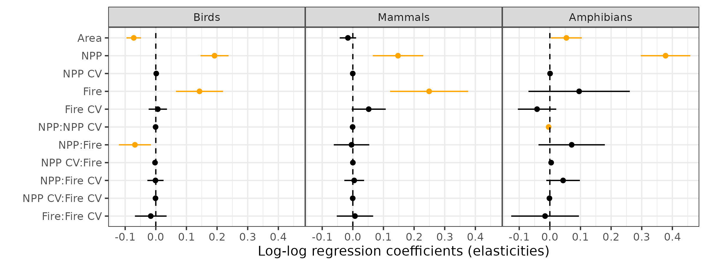
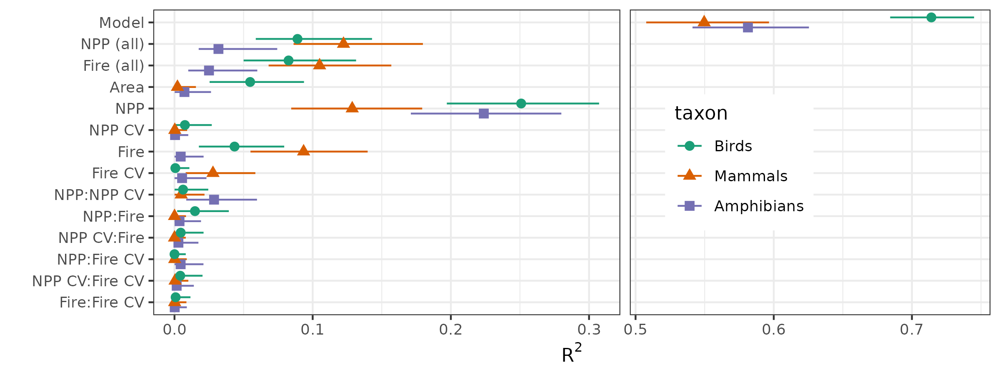

```{r setup, include=FALSE}
## don't print results unless making in 'full' mode
sr <- Sys.getenv("SHOW_RESULTS")
show_res <- sr != ""  && as.logical(sr)
if (!show_res) { knitr::opts_chunk$set(results="hide", fig.keep="none") }
```

# Overview (mixed models essentials and subject-matter intro)

## Mixed models essentials

### What are mixed models good for?

>  a broad class of statistical models that **extend linear and generalized linear models** to handle data where **observations are measured within discrete groups** such as field sites; years or other temporal blocks; individuals that are observed multiple times; genotypes; species; etc. They can be thought of (equivalently) as (1) **accounting for the correlation** among observations from the same group; (2) **estimating the variability** among groups, or (3) **parsimoniously estimating the effects of groups**. They are most useful when the experimental or observational design includes a large number of groups with varying numbers of observations per group.

### What is a random effect anyway?

- A *grouping variable* `g` (must be discrete!) and a *varying term* `f`
- denoted as `(f | g)` in most R MM packages
- "the effect of `f` varies across groups defined by `g` (`f` = `1` → intercept)
- effects of `f` for each group `g` estimated by *shrinkage* (empirical Bayes, joint Bayesian prior, ...)

### When should you use a random effect?

- **don't** want to test hypotheses about differences between groups
- **do** want to quantify the variability across groups
- **do** want to make predictions for unobserved groups
- **do** want to combine information across groups
- **do** have variation in information per group (samples, noise)
- **do** have groups randomly sampled from a population
- **do** have a categorical *nuisance variable*
- **do** have *exchangeable* groups
- **do** have "many" (> 5-6) groups; small $n$ per group; unbalanced groups

cf. @Crawley2002, @gelman_analysis_2005

### What tools?

- Mostly `lme4`; `gamm4` to deal with spatial autocorrelation
- Some `ggplot2`, maybe some tidyverse
- diagnostics etc.; `broom.mixed`, `DHARMa`, `car` (using `::` notation as appropriate)
- Other (G)LMM-adjacent packages listed [here](https://docs.google.com/spreadsheets/d/19itelYaVW0U0gtNtRfqh76ZGt1awlamNcJwT71u_5Uk/edit#gid=0)

## Science intro

### What is this project?

- Paper in progress/review with Max Moritz (UCSB) and Enric Batllori Presas (Univ Barcelona)
- Use synthetic global-scale databases of species richness, primary productivity, wildfire to quantify relationships between (NPP, fire consumption) and richness

### Pictures?



### Analytical goals?

- estimate effects of NPP (g C m$^2$/year), fire consumption (% of NPP), interannual CV of NPP and fire consumption, and their interactions, on species richness
- at the global level and possibly variation across different geographic scales

### need for mixed models: geographic variation

- realms (large-scale) (e.g. "Neotropics")
- biomes (medium-scale, environmental) (e.g. "tropical grassland")
- biome × realm interaction ("tropical grasslands in the Neotropics")
- "ecoregion": sampling unit [@olson_terrestrial_2001]

### nesting and crossing of random effects

**Nested**: sub-unit IDs only measured within a single larger unit.
e.g.: Plot1 in Block1 independent of Plot1 in Block2



**Crossed**: sub-unit IDs can be measured in multiple larger units.
e.g. year, site


**Unique coding**: removes ambiguity



Robert Long, [Cross Validated](https://stats.stackexchange.com/questions/228800/crossed-vs-nested-random-effects-how-do-they-differ-and-how-are-they-specified)

### random effects terms

- "random effect of X" usually means intercept variation only, by default (but see @schielzeth_conclusions_2009)
  - one parameter (variance/std dev of intercept across groups)
- RE terms with `n` parameters (intercept + slope = 2)
  - `n*(n+1)/2` parameters
  - 10 for this example
- RE terms with `n` **independent** effects (`||` shortcut); only `n` parameters
  - 4 for this example
  
### more preliminaries

- we'll work with *log-scaled* NPP/fire, raw CVs, all *centered* [@schielzeth_simple_2010]
- effects all evaluated at *geometric mean* of other variables
- coefficients are approximately *elasticities*

### finally, before we start ...

```{r GHpix, fig.keep = "all", fig.show = "asis", results="show"}

```

@gelman_data_2006

---

```{r UYpix, fig.keep = "all", fig.show = "asis", results="show"}

```
	
@uriarte_preaching_2009

# Coding

### load packages

Load packages up front, note what they're used for ...

```{r pkgs, message=FALSE}
library(tidyverse); theme_set(theme_bw())
library(lme4)
library(gamm4)
## diagnostics
library(DHARMa)
library(car) ## influencePlot
## extraction/graphics
library(broom.mixed)
library(dotwhisker)
library(gridExtra)
## from GitHub: see utils.R
library(r2glmm) ## bbolker/r2glmm
library(remef)  ## hohenstein/remef
source("utils.R")
source("gamm4_utils.R")
```

### load data

```{r data}
dd <- readRDS("data/ecoreg.rds")
```

### simplest model

Single-level model (biomes), intercept variation only. All pairwise interactions of main variables (`(...)^2`), plus (log of) ecoregion area:

```{r fit1}
m1 <- lmer(mbirds_log ~ log(area_km2) + (Feat_log_sc + Feat_cv_sc + NPP_log_sc + NPP_cv_sc)^2 +
             (1 | biome),
           data = dd)
## may get
## Warning message:
## Some predictor variables are on very different scales: consider rescaling 
```

### diagnostics

Best practice: check diagnostics **as early as possible** (before `summary()`, coeff plots) to reduce snooping.

```{r diag, fig.keep="none", results="hide"}
plot(m1, type = c("p", "smooth"))
## heteroscedasticity
plot(m1, sqrt(abs(resid(.))) ~ fitted(.), type = c("p", "smooth"))
car::influencePlot(m1)
plot(DHARMa::simulateResiduals(m1))
```

```{r coefplot}
## basic coefficient plot
dotwhisker::dwplot(m1, effects="fixed") + geom_vline(xintercept = 0, lty = 2)
## ordered coefficient plot (from utils.R)
dwplot_ordered(m1, effects = "fixed")
```

### add RE terms

- allow the main effects to vary across biomes (in a correlated way)
- `update()` is your friend

```{r fit2, cache=TRUE, message=FALSE}
m2 <- update(m1, . ~ . - (1|biome) + (1 + Feat_log_sc + Feat_cv_sc + NPP_log_sc + NPP_cv_sc | biome))
```

```{r plot_fit2}
## compare plots
dwplot_ordered(list(intercept_only = m1, full = m2), effects = "fixed")
```

### three-level model

Now go to the (almost) maximal model; variation of main effects at all three geographic levels

```{r three_level, cache=TRUE}
## ~ 30 seconds
max_model <- lmer(mbirds_log ~ log(area_km2) + (Feat_log_sc + Feat_cv_sc + NPP_log_sc + NPP_cv_sc)^2 +
                    (Feat_log_sc + Feat_cv_sc + NPP_log_sc + NPP_cv_sc | biome) +
                    (Feat_log_sc + Feat_cv_sc + NPP_log_sc + NPP_cv_sc | flor_realms) +
                    (Feat_log_sc + Feat_cv_sc + NPP_log_sc + NPP_cv_sc | biome_FR),
                  data = dd,
                  ## for speed/skip convergence warnings
                  control = lmerControl(calc.derivs = FALSE))
```

### checking the covariance parameter estimates

```{r eval_three_level}
isSingular(max_model)
lwr <- getME(max_model, "lower"); theta <- getME(max_model, "theta"); min(theta[lwr == 0])
VarCorr(max_model)
```

### maximal model

- idea
- why it usually doesn't work
   - complexity
   - confounding with residual variance: [starling mixed model example](https://ms.mcmaster.ca/~bolker/classes/uqam/mixedlab1.html)

### model simplification

- avoid singularity/non-convergence [@barr_random_2013; @schielzeth_conclusions_2009]
- data-driven (AIC, p-value) [@bates_parsimonious_2015; @matuschek_balancing_2017]

### non-convergence vs singularity

- convergence warnings: historical reasons
- very unreliable (and slow!) for large data sets (>10,000 observations)
- gold standard: run `allFit()`, diagnose/evaluate differences in effects of interest


### AIC table/strategy

- `for` loop over table
- fitting many models is a [code smell](https://en.wikipedia.org/wiki/Code_smell) but sometimes you can't avoid it
- `reformulate()` is useful

```{r model_table, cache = TRUE}
all_vars <- "1 + Feat_log_sc + Feat_cv_sc + NPP_log_sc + NPP_cv_sc"
v1 <- expand.grid(c("1 | ", paste(all_vars, "|"), paste(all_vars, "||")),
                  c("biome", "flor_realms", "biome_FR"))
v2 <- sprintf("(%s)", apply(v1, 1, paste, collapse = " "))
## use cross_df instead of expand.grid, want chars
v3 <- cross_df(list(biome = v2[1:3], FR = v2[4:6], biome_FR = v2[7:9]))
v3[1,]
```

```{r fit_models, eval=FALSE}
model_list <- list()
p1 <- proc.time()
for (i in 1:nrow(v3)) {
  cat(i, unlist(v3[i,]), "\n")
  form <- reformulate(
      c(sprintf("(%s)^2", all_vars), ## main effects and 2-way interax
        "log(area_km2)",             ## plus ecoregion area
        unlist(v3[i,])),             ## plus specified REs
      response = "mbirds_log")
  model_list[[i]] <- lmer(form, data = dd) ## fit model
}
saveRDS(model_list, file = "data/model_list.rds")
proc.time() - p1
```

### extract summary info from models, take a look

```{r summarize}
model_list <- readRDS("data/model_list.rds")
aic_vec <- sapply(model_list, AIC)
is_sing <- sapply(model_list, isSingular)
conv_warn <- sapply(model_list, has_warning)
tibble(model=1:27, aic_vec, is_sing, conv_warn) %>% arrange(aic_vec)
```

### find best-AIC, non-singular model

```{r get_best}
best_index <- which(aic_vec == min(aic_vec) & !is_sing & !conv_warn)
best_model <- model_list[[best_index]]
```

### check it out

```{r best_model}
best_model
```

## diagnostics

### basics

```{r diag_bestmodel, fig.keep="none", results="hide"}
plot(best_model, type = c("p", "smooth"))
## heteroscedasticity
plot(best_model, sqrt(abs(resid(.))) ~ fitted(.), type = c("p", "smooth"))
car::influencePlot(best_model)
plot(sr <- simulateResiduals(best_model))
```

### What's going on with DHARMa?

Computes residuals at *population level* (usually a good default but not necessarily appropriate here?)

```{r check_dharma}
DHARMa::plotResiduals(sr, dd$NPP_log_sc)
```

```{r compare_dharma}
pop_resids <- model.response(model.frame(best_model)) - predict(best_model, re.form=NA)
p1 <- lattice::xyplot(pop_resids ~ dd$NPP_log_sc, cex = 1, type = c("p", "smooth"),
                      main = "pop resids (DHARMa)")
p2 <- plot(best_model, resid(.) ~ NPP_log_sc, type=c("p", "smooth"),
           main = "unit resids (lme4)")
gridExtra::grid.arrange(p1, p2, nrow = 1)
```

### spatial correlation

Easiest to explore spatial correlations graphically:

```{r spatcorr}
dd$res1 <- residuals(best_model)
ggplot(dd, aes(x, y, colour = res1, size = abs(res1))) +
  geom_point() +
  scale_colour_gradient2() +
  scale_size(range=c(2,7))
```

- Can see sub-realm geographic variation
- Could work on spatial variograms, Moran's I statistic, etc..

### refit with `gamm4`

Quickest (not necessarily best) fix for spatial autocorr; `bs="sos"` is a *spherical* smooth

```{r gamm4, cache=TRUE}
gamm4_form  <- update(formula(best_model), . ~ . + s(y, x, bs="sos"))
best_gamm4 <- gamm4(formula = nobars(gamm4_form),
                    random = as.formula(reOnly(gamm4_form)),
                    data = dd)
class(best_gamm4) <- c("gamm4", "list") ## so we can tidy etc. (using gamm4_utils.R)
```

### compare results

```{r lme4_gamm4_comp}
dwplot_ordered(list(best_gamm4, best_model), effects="fixed")
```

## display/description

### coefficient plots

- with `dotwhisker::dwplot()` as shown before, or `broom.mixed::tidy()` + `ggplot` tweaking
- scaled or unscaled coefficients?



### $R^2$ and partial $R^2$ values

  

```{r rsqvals}
rsqvals <- r2glmm::r2beta(best_model, method = "sgv", partial = TRUE)
## set (reverse)factor order (or forcats::fct_inorder())
rsqvals$Effect <- factor(rsqvals$Effect, levels = rev(rsqvals$Effect))
ggplot(rsqvals, aes(x=Rsq, xmin = lower.CL, xmax = upper.CL, y = Effect)) +
  geom_pointrange()
```

### prettier version



### prediction plots

```{r pred_plots}
NPPvec <- with(dd, seq(min(NPP_log_sc), max(NPP_log_sc), length.out = 51))
pred <- emmeans::emmeans(best_model, ~NPP_log_sc, at = list(NPP_log_sc = NPPvec))
gg0 <- ggplot(as.data.frame(pred),
              aes(NPP_log_sc, emmean)) + geom_line() +
  geom_ribbon(aes(ymin=lower.CL, ymax = upper.CL), alpha = 0.2, colour = NA)
gg1 <- gg0 + geom_point(data = dd, aes(y = mbirds_log, colour = biome))
print(gg1)
```

Can also back-transform, unscale, etc. (see e.g. [Stack Overflow Q1](https://stackoverflow.com/questions/53324971/back-transform-coefficients-from-glmer-with-scaled-independent-variables-for-pre/53735644#53735644), [Stack Overflow Q2](https://stackoverflow.com/questions/53193940/plotting-results-of-logistic-regression-with-binomial-data-from-mixed-effects-mo))

### partial residuals

Compute *partial residuals* and display:

```{r remef_compare}
dd$remef <- remef::remef(best_model, fix = "NPP_log_sc")
grid.arrange(gg1,
             gg0 + geom_point(data = dd, aes(y = remef, colour = biome)) +
             scale_y_continuous(limits = range(dd$mbirds_log)),
             nrow=1)
```

### random effects

- Can extract, plot, etc. examine random effects
- Built-in `dotplot`, `qqmath` methods
- Or use `as.data.frame(ranef())` or `broom.mixed::tidy(model, effects = "ran_vals")`
- For this problem, REs were interesting but too noisy to draw conclusions from

```{r ranef, fig.width=12}
grid.arrange(grobs = lattice::dotplot(ranef(best_model)), nrow=1)
```

# extras

### further reading

- @gelman_data_2006; @mcelreath_statistical_2015; @bolker_glmm_2014 (see [worked examples](http://bbolker.github.io/mixedmodels-misc/ecostats_chap.html)); @wood_generalized_2017
- with caveats: @zuur_mixed_2009 (and others); @bolker_generalized_2009

### GLMMs

- the entire layer of GLMMs can be added
- standard families (Poisson/Gamma/binomial etc.) via `glmer`
- zero-inflation, Tweedie, neg binom ... `glmmTMB`, `brms`
- more complex machinery (Gauss-Hermite quadrature, `GLMMadaptive`: or go Bayesian)
- observation-level random effects

### Bayesian approaches

- slower but you get more
- regularization is easy 
- informative priors
- better handling of uncertainty, especially for complex models

### regularization

- if you want to fit a very complex model but prevent singular fits etc., you need to **regularize** the model somehow (i.e. force it to be sensible)
- this is easiest to do in a Bayesian or semi-Bayesian framework
- `blme`, `MCMCglmm`, `rstanarm`, `brms` ...

### model simplification/covariance structures

beyond intercept-only and diagonal structures 

- @barr_random_2013 also discusses slope-only models
- **compound symmetry** (all-equal correlations)
    - `(1|g/f)` instead of `(f|g)` for factor terms
    - `cs()` in `glmmTMB`, other possibilities in `nlme::lme`, `MCMCglmm`, `brms`, ...
- **factor-analytic** models (Maeve McGillycuddy, UNSW)
   
### autocorrelation

- `mgcv`: Markov random field, etc.
- `brms`: can use all `mgcv` smooths
- `INLA`: probably best for spatial/temporal, but a whole other world
- `glmmTMB`: simple space/time stuff with complex GLMMs

### REML vs ML

- not as important as people think?
- analogous to dividing by $n-1$ instead of $n$ when computing variance
- REML better for RE covariance estimates
- ML **required** for model comparison

### mixed-model ecosystem in R

<!-- 

### To do

- univariate exploratory plots?
- does max model not report singularity ...? (`isSingular`/singular tol mismatch?)
- `allFit` example?
- prettier ecoregions plot?
- GH/YU side-by-side?
- lme4: allow full expansion on RHS of bar `(a+b+c|d+e+f)`
- why doesn't `lattice::qqmath(ranef(best_model))` work?

-->

# references

## references

