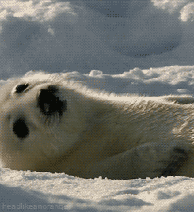

<!-- avoid border around code -->
<style>
  #TOC {
    border: 0;
  }
  .list-group-item.active, .list-group-item.active:focus, .list-group-item.active:hover {
    background-color: #698b69;
}
</style>

```{r setup, include=FALSE}
knitr::opts_chunk$set(echo = TRUE, fig.width = 10)
```

This tutorial is heavily based on the Appendices and Supporting Information found in the Open Access {aniMotum} paper:

- Jonsen ID, Grecian WJ, Phillips L, Carrol G, McMahon C, Harcourt RG, Hindell MA & Patterson TA (2023) aniMotum, an R package for animal movement data: Rapid quality control, behavioural estimation and simulation. Methods in Ecology and Evolution 14(3): 806-816  https://doi.org/10.1111/2041-210X.14060

Please refer to the paper, appendices and the R package documentation for a comprehensive overview of {aniMotum}:
https://ianjonsen.github.io/aniMotum/

---

## Before we begin

Please download the {aniMotum} package from R-Universe.

```{r, eval = F}
# install from my R-universe repository
install.packages("aniMotum", 
                 repos = c("https://cloud.r-project.org",
                 "https://ianjonsen.r-universe.dev"),
                 dependencies = TRUE)
```

This installs all Imported and Suggested R packages from CRAN and R-universe. If queried, answer Yes to install the source version. Note, if you haven’t installed {aniMotum} previously then installation of dependent packages may take a while, especially if many of them need to be compiled. You should only need to go through this once, subsequent installation of {aniMotum} updates will be much faster.

Alternatively you can download a binary version of aniMotum here: https://ianjonsen.r-universe.dev/aniMotum

For full instructions see the aniMotum homepage on GitHub: https://github.com/ianjonsen/aniMotum

---

# Introduction

The aim of this practical is to give you an understanding of how we can use the {aniMotum} R package to process and analyse animal movement data. My aim is that you can go on to apply similar workflows to your own animal movement data.

During this practical we will:

1. Load in an example data set
2. Fit a state-space model to regularise and error correct a movement path
3. Visualise the model fit
4. Fit a move persistence model to estimate behaviour
5. Extract the regularised data
6. Manual mapping

This practical will be based on the {tidyverse} style of R coding. You will become familiar with using pipes `|>` to perform data manipulations, using `ggplot` to generate publication quality figures, and using the {sf} package to handle spatial data.

For more information on the {tidyverse} check out the Wickham & Grolemund book 'R for Data Science'.
You can access it for free online here:  
https://r4ds.had.co.nz

The project website can be accessed here:  
https://www.tidyverse.org

For more information on the {sf} project check out https://r-spatial.github.io/sf/

As discussed in the presentation we can pass data from several different tag types to {aniMotum}.
For an outline of how {aniMotum} expects this data to be formatted see:
https://ianjonsen.github.io/aniMotum/articles/Overview.html

---

# Practical

In March 2019 I was part of an expedition to deploy Satellite Relay Data Loggers on harp seal pups in the Gulf of St Lawrence, Canada. These devices are satellite linked computers capable of recording a wide range of information and transmitting it via the Argos network. Here we will focus on the location data recorded by the Argos satellites when communicating with three of the tags.

Harp seals give birth on the sea ice when it is at it’s most southerly extent in late Winter/ early Spring. Females wean their pup after around 2 weeks. We deployed tags on pups that were approximately 3 weeks old, and tracked their movements as they left the sea ice and began their first migration north.

This work was published in Royal Society Open Science and is available Open Access here:

- Grecian WJ, Stenson GB, Biuw M, Boehme L, Folkow LP, Goulet PJ, Jonsen ID, Malde A, Nordøy ES, Rosing-Asvid A & Smout S (2022) Environmental drivers of population-level variation in the migratory and diving ontogeny of an Arctic top predator Royal Society Open Science 9: 211042 https://doi.org/10.1098/rsos.211042

## Loading data

Data for 3 animals are available in the repo. Lets load them into R and have a quick look.

The harp data are formatted in a standard way for Argos data and include Argos' Least-Squares-based location error classes `lc`. This is the minimum required by `fit_ssm`:  
- `id` a unique identifier for each animal (or track) in the `data.frame` or `tibble`.  
- `date` a date-time variable in the form YYYY-mm-dd HH:MM:SS (or YYYY/mm/dd HH:MM:SS).
- `lc` the location class variable common to Argos data, with classes in the set: 3, 2, 1, 0, A, B, Z.  
- `lon` the longitude variable.   
- `lat` the latitude variable.   

```{r, warning = F, message = F}
# load libraries
library(aniMotum)
library(patchwork)
library(sf)
library(tidyverse)

# load harp seal locations
locs <- read_csv("harps.csv")
locs
```

The `lc` values determine the measurement error variances (based on independent data, see [Jonsen et al. 2020](https://doi.org/10.1186/s40462-020-00217-7)) used in the SSM’s for each observation.

Since 2011, the default Argos location data uses CLS Argos’ Kalman Filter (KF) algorithm. These data include error ellipse information for each observed location in the form of 3 variables: ellipse semi-major axis length, ellipse semi-minor axis length, and ellipse orientation.

The column names follow those for Argos LS data, with the following additions:  
- `smaj` the Argos error ellipse semi-major axis length (m).  
- `smin` the Argos error ellipse semi-minor axis length (m).  
- `eor` the Argos error ellipse ellipse orientation (degrees from N).  

Here, the error ellipse parameters for each observation define the measurement error variances used in the SSM’s ([Jonsen et al. 2020](https://doi.org/10.1186/s40462-020-00217-7)). Missing error ellipse values are allowed, in which case, those observations are treated as Argos LS data.

```{r}
# preliminary plot
p1 <- ggplot() +
  theme_bw() +
  geom_point(aes(x = lon, y = lat), data = locs) +
  facet_wrap(~id)
print(p1)
```

The plot reveals one track has large gaps while the others have (at least one) obviously erroneous location estimates.

Let's check how frequently the tags were transmitting. This can guide the frequency of regularised locations estimated by {aniMotum}.

```{r}
locs |>
  group_by(id) |>
  summarise(mean_interval_hrs = as.numeric(mean(difftime(date, lag(date)), na.rm = T), "hours"),
            max_interval_hrs = as.numeric(max(difftime(date, lag(date)), na.rm = T), "hours"))
```

On average two of the tags were transmitting hourly, with the first tag only transmitting every 3 hours. This difference is probably driven by the large gaps in transmission: 303 hours is 12.5 days!

## Fit a state-space model

We can use {aniMotum} to regularise and error correct these movement paths using a state-space model. For speed/ simplicity we'll ask for daily locations, but you can easily adjust this depending on your questions. For example, in the RSOS paper I dropped the data with large gaps and then used a 6-hour interval to match the locations to the 6-hour dive summary data transmitted by the tags.

We can fit to all animals in the same call using the `fit_ssm` function. Here I'm fitting a correlated random walk with `model = "crw"` other options are random walk (`model = "rw"`) and move persistence (`model = "mp"`).

```{r}
fit <- fit_ssm(locs,
        vmax = 5,
        model = "crw",
        time.step = 24,
        control = ssm_control(verbose = 0))
```

You can access the results and summary information about the model fit with the `summary` function:

```{r}
summary(fit)
```

## Visualise the model fit

We can quickly check the model fit via a 1-D time series plot of the model:

```{r, fig.height = 8}
plot(fit,
     what = "predicted",
     type = 1,
     pages = 1)
```

The fitted points (orange) are overlayed on top of the observations (blue). Note the uncertainty increases when interpolating across the gaps we highlighted earlier. You would need to carefully consider whether to include these interpolated sections in any further analysis.

A 2-D plot of the model:

```{r}
plot(fit,
     what = "predicted",
     type = 2,
     pages = 1,
     ncol = 3)
```

Again the 2D plot highlights the uncertainty in hp6-747-19's path.

We can map the predicted locations straight from the `fit_ssm` object as follows:

```{r}
aniMotum::map(fit,
              what = "predicted")
```


Often when validating models we want to assess residual plots. {aniMotum} offers the option of calculating one-step-ahead prediction residuals. 
These can be helpful but are computationally demanding: this may take 10-20 times longer than it takes to fit the SSM.

We calculate the residuals via the `osar` function and can visualise them as a time-series, QQ plot and autocorrelation plot. 

```{r, cache = T}

res <- osar(fit)

```


```{r, fig.height = 9}

plot(res, type = "ts", pages = 1) | plot(res, type = "qq", pages = 1) | plot(res, type = "acf", pages = 1)

```

The time series and autocorrelation plots suggest that the `crw` model is a good fit to the data, although there are long-tails in the QQ plot suggesting the model doesn't do well at very short or large step lengths. We could re-run the models as `rw` or `mp` and see how this impacts model fit.

## Fit a move persistence model

We may be interested in inferring how an individuals behaviour changes along the movement path. Move persistence is a *continuous* behavioural index that captures autocorrelation in both speed and direction. For more information on move persistence please read:

- Jonsen, ID, McMahon, CR, Patterson TA, Auger-Méthé M, Harcourt R, Hindell MA & Bestley S (2019). Movement responses to environment: Fast inference of variation among southern elephant seals with a mixed effects model. Ecology 100: e02566 (https://doi.org/10.1002/ecy.2566)

This is a different approach to discrete states estimated using methods such as hidden Markov models. For information on those see previous EFI/ ESA webinars by Théo Michelot and Vianey Leos Barajas.

Move persistence models can be fit either using `fit_mpm` or simultaneous to the state-space model fit via the `model = "mp"` argument in `fit_ssm`.

If you fit the model with `fit_mpm` then there is the option to estimate move persistence independently for each animal (`model = "mpm"`), or sharing a parameter across individuals (`model = "jmpm"`).

If you fit the model with `fit_ssm` via `model = "mp"` then uncertainty in the location is included in the move persistence fit. These two approaches are unlikely to return identical results, which you use will depend on your particular case study.

Here we fit a joint move persistence model to the SSM output and plot the results using the default plot function.

```{r}

fmpm <- fit_mpm(fit,
                what = "predicted",
                model = "jmpm",
                control = mpm_control(verbose = 0))
plot(fmpm,
     pages = 1,
     ncol = 2)

```

You can see each path varies between periods of high and low move persistence. This suggests there are changes in the movements indicative of periods of migration and periods of residency. See the [Manual Mapping](#manual-mapping) section for an example of mapping the migration and visualising move persistence.

It is also possible to go on to link move persistence to environmental covariates. Take a look at Jonsen et al. ([2019](https://doi.org/10.1002/ecy.2566)) for the method and Grecian et al. ([2022](https://doi.org/10.1098/rsos.211042)) for an application to this data set.


## Data extraction

You may want to extract the regularised data output from `fit_ssm` to use in a difference application, or you may want to generate your own maps. You can do this with the `grab` function:

```{r}
# extract predicted locations and their move persistence estimates
df_locs <- fit |> grab("predicted")
df_mpm <- fmpm |> grab("fitted")

# combine
df <- df_locs |> left_join(df_mpm)
df

```


## Manual mapping

To generate a map we need to load a suitable shapefile from the {rnaturalearth} package. These can be loaded into your session as an {sf} object ready to be plotted with `geom_sf`. I've then created an {sf} object manually from the `df` object containing the regularised locations and their corresponding move persistence estimates.

Given the geographic region, I've defined `prj` as custom Lambert Azimuthal Equal Area projection centred on the study region. We specify the projection via the `coord_sf` function.

```{r}
#install.packages("rnaturalearth")
require(rnaturalearth)

# Generate a global shapefile and a simple plot
world <- ne_countries(scale = "medium", returnclass = "sf")

# To generate a plot with less distortion first define a projection i.e. Lambert Azimuthal Equal Area
prj = "+proj=laea +lat_0=60 +lon_0=-50 +x_0=0 +y_0=0 +datum=WGS84 +units=m +no_defs +ellps=WGS84 +towgs84=0,0,0"

# Create an sf version of the locs data with a WGS84 projection and add to the plot
df_sf <- df |> 
  st_as_sf(coords = c('lon', 'lat')) |>
  st_set_crs(4326)

ggplot() +
  theme_bw() +
  geom_sf(aes(), data = world) +
  geom_sf(aes(colour = g), data = df_sf, show.legend = "point") +
  scale_color_viridis_c(expression(gamma[t]), limits = c(0,1)) +
  coord_sf(xlim = c(-2000000, 2000000), ylim = c(-2500000, 2500000), crs = prj, expand = T) +
  scale_x_continuous(breaks = seq(from = -130, to = 30, by = 10)) +
  facet_wrap(~id, nrow = 1)


```

This nicely illustrates the most likely path of the three animals from the pupping ground in the Gulf of St Lawrence as they migrate north. 
Colouring the points by move persistence ($\gamma$^t^) highlights periods when the animals were moving faster and more directed (lighter colours) and 
when the animals were travelling slower and less directed (darker).

<center>


</center>

# Extras

## An example GPS data set

We can also use {aniMotum} to process animal movement data collected by GPS devices or Geolocation sensors.
To do this we need to specify a different location class via the `lc` argument in `fit_ssm`.

The following little penguin data set is available in the supplementary material to the aniMotum paper. Note the `lc` column contains the letter `G` to indicate to {aniMotum} that this is GPS data.

GPS devices will only be able to fix their location when the penguin is at the surface, and so unsuprisingly the GPS tracks contain many gaps when the animals were diving. For a more detailed analysis of the little penguin data please read the [original paper](https://doi.org/10.1098/rsos.220028) alongside the analysis in the aniMotum paper.

Here we regularise the location data to 2 minute temporal resolution (`fit_ssm` expects the input in hours) and calculate move persistence.

```{r, warning = F, message = F}

lipe <- read_csv("https://raw.githubusercontent.com/ianjonsen/foieGras.paper/main/data/lipe_gps_ex32.csv")
lipe

lipe_ssm <- fit_ssm(lipe,
        vmax = 5,
        min.dt = 5,
        model = "crw",
        time.step = 2/60,
        control = ssm_control(verbose = 0))

lipe_fmpm <- fit_mpm(lipe_ssm,
                what = "predicted",
                model = "jmpm",
                control = mpm_control(verbose = 0))

aniMotum::map(lipe_ssm, what = "predicted") | plot(lipe_fmpm, ncol = 2, pages = 1)

```

In some cases when fit to GPS data the SSM struggles to estimate the observation error correlation parameter `rho_o`.
This can be switched off by including `map = list(rho_o = factor(NA))` in the call to the `fit_ssm` function.

## Some thoughts on fitting models

When fitting models in R it's easy to forget the heavy lifting that these models are often doing behind the scenes.

A discrete-time state-space model fit to animal movement data via MCMC would take hours or even days to run. In the last few years, the development of newer methods (i.e. the implementation of Laplace Approximation and Template Model Builder) continuous-time versions of these models take just minutes to fit.

This also means it's tempting to try fitting a model without doing thorough data checks first.

Most issues can be avoided by checking the following before passing any data to `fit_ssm`:
1. ensure unique id's between animals or tracks in your data set
2. check your date time format
3. remove rows with missing values

It's also important to remember what location class your data have. If they are GPS or geolocation then make sure you adjust the data frame to include this information in the `lc` column.

Ideally, geolocation data will have errors information associated with each location. These can be passed as columns x.sd and y.sd, in the same units as the lon lat columns. If you do not have these data then a good starting place is somewhere between 0.25 and 1 deg for Latitude and half that value for Longitude.

# Conclusions

I hope practical this has given you an insight into how {aniMotum} can help you process and analyse animal movement data. The aim is for it to be simple and straightforward to use, while also being capable of more complex analyses when required.

For more code examples please refer to the paper, supplementary materials and the online documentation for the package.

You can discover a little more about our work on the harp seal pups by watching the BBC's [Frozen Planet II](https://www.bbcearth.com/shows/frozen-planet-2)

# References

- Grecian WJ, Stenson GB, Biuw M, Boehme L, Folkow LP, Goulet PJ, Jonsen ID, Malde A, Nordøy ES, Rosing-Asvid A & Smout S (2022) Environmental drivers of population-level variation in the migratory and diving ontogeny of an Arctic top predator. Royal Society Open Science 9: 211042 https://doi.org/10.1098/rsos.211042

- Jonsen ID, McMahon CR, Patterson TA, Auger-Méthé M, Harcourt R, Hindell MA & Bestley S (2019) Movement responses to environment: Fast inference of variation among southern elephant seals with a mixed effects model. Ecology 100: e02566 https://doi.org/10.1002/ecy.2566

- Jonsen ID, Patterson TA, Costa DP, Doherty PD, Godley BJ, Grecian WJ, Guinet C, Hoenner X, Kienle SS, Robinson PW, Votier SC, Whiting S, Witt MJ, Hindell MA, Harcourt RG & McMahon CR (2020) A continuous-time state-space model for rapid quality control of Argos locations from animal-borne tags. Movement Ecology 8: 31 https://doi.org/10.1186/s40462-020-00217-7

- Jonsen ID, Grecian WJ, Phillips L, Carrol G, McMahon C, Harcourt RG, Hindell MA & Patterson TA (2023) aniMotum, an R package for animal movement data: Rapid quality control, behavioural estimation and simulation. Methods in Ecology and Evolution 14(3): 806-816  https://doi.org/10.1111/2041-210X.14060

- Phillips LR, Carroll G, Jonsen I, Harcourt R, Brierley AS, Wilkins A, & Cox M (2022) Variability in prey field structure drives inter-annual differences in prey encounter by a marine predator, the little penguin. Royal Society Open Science 9: 220028 https://doi.org/10.1098/rsos.220028
