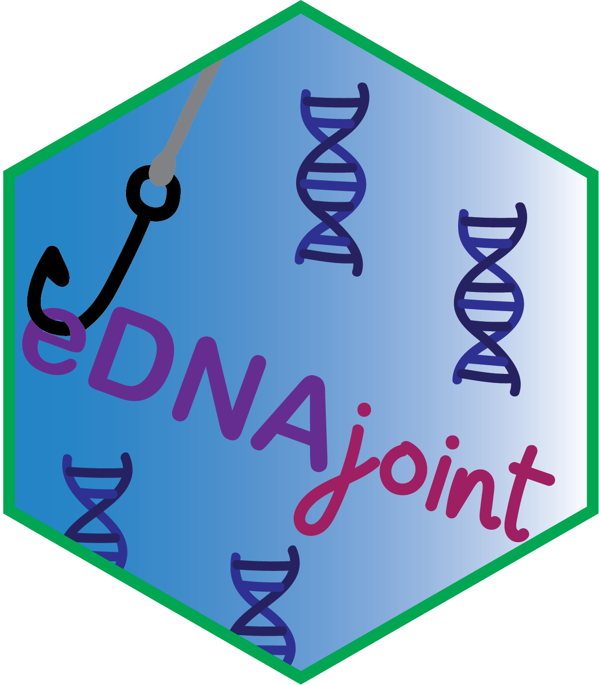

# eDNAjoint EFI Statistical Methods Seminar

The package *eDNAjoint* is useful for interpreting observations from
paired or semi-paired environmental DNA (eDNA) and traditional surveys.
The package runs a Bayesian model that integrates these two data streams
to jointly estimate parameters like the false positive probability of
eDNA detection and expected catch rate at a site. Optional model
variations allow inclusion of site-level covariates that scale the
sensitivity of eDNA sampling relative to traditional sampling, as well
as estimation of gear scaling coefficients when multiple traditional
gear types are used. Additional functions in the package facilitate
interpretation of model fits.

## Workshop materials

`Demo.Rmd`: Code for example workflow with endangered tidewater goby
data and site-level covariates.

`Demo.pdf`: Rendered pdf of example workflow with endangered tidewater
goby data and site-level covariates.

`eDNAjoint_EFI_presentation.pptx`: Presentation slides.

## Resources

eDNAjoint [user guide](https://ednajoint.netlify.app/)

[Paper](https://doi.org/10.1111/2041-210X.70000) in *Methods in Ecology
and Evolution* about eDNAjoint

eDNAjoint [code
repository](https://github.com/ropensci/eDNAjoint/tree/master)
