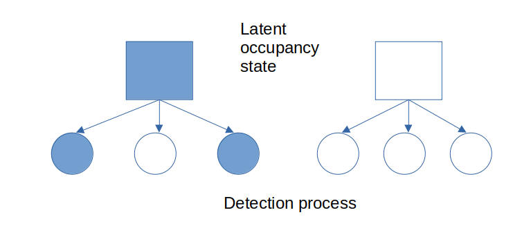
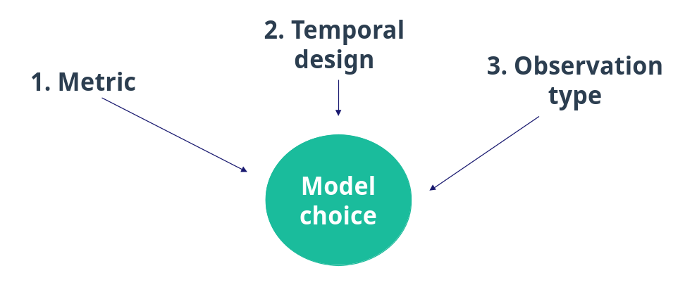
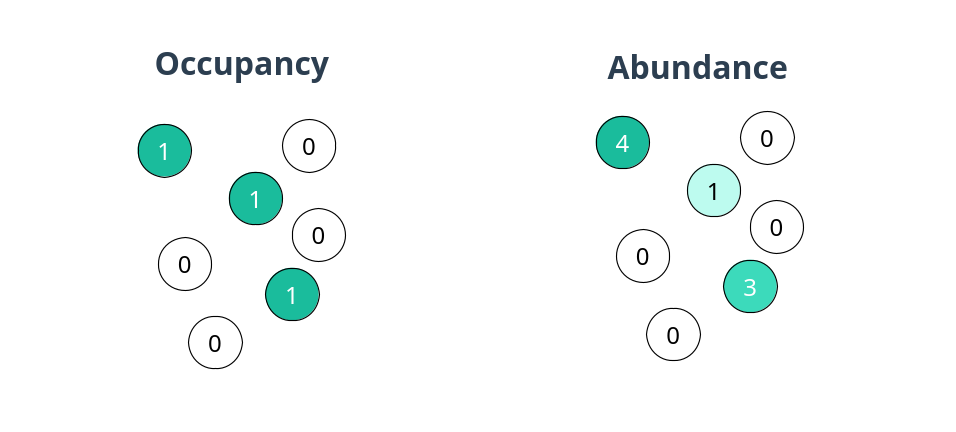
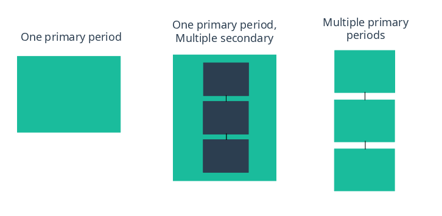
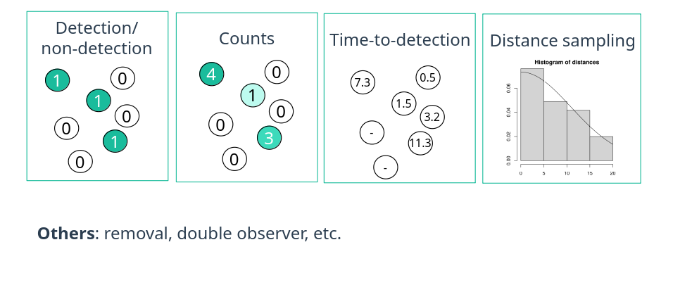
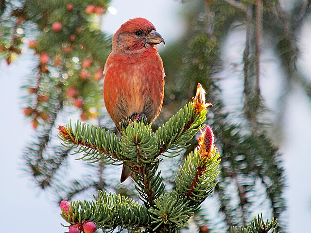

# The `unmarked` R package for fitting hierarchical models of animal abundance and occurrence

Ken Kellner

# Outline

1. Overview of hierarchical models
2. The `unmarked` package
    - Organization
    - Supported models
3. Package demonstration
4. Recent features
    - Random effects
    - Simulation
    - Power analysis
5. Future directions
6. Questions

# Overview of hierarchical models in ecology

* Detection is imperfect when observing animal populations
* If detection is ignored, we're actually measuring a combination of state and detection processes
* Solution: explicitly model state and detection processes separately

## Classic example: the occupancy model



### State process

**Parameters**

$z_i$: Latent occupancy at site $i$

$\psi_i$: Occupancy probability at site $i$

**Math**

$$z_i \sim \mathrm{Bernoulli}(\psi_i)$$

Model $\psi$ as function of covariates:

$$\psi_i = \mathrm{logit}^{-1}(\beta_0 + \beta_x \cdot x_i ... )$$

### Detection process

**Parameters/data**

$y_{ij}$: Observed detection at site $i$ for repeated sample $j$

$p_{ij}$: Probability of detecting an individual at site $i$ in sample $j$

**Math**

$$y_{ij} \sim \mathrm{Bernoulli}(p_{ij} \cdot z_i)$$

### Data example

| Site | Occasion 1 | Occasion 2 | Occasion 3|
|------|------------|------------|-----------|
| A    | 0          | 1          | 0         |
| B    | 1          | 0          | 1         |
| C    | 0          | 0          | 0         |

### Key assumptions

* Population is closed during the repeated samples
* Repeated samples are independent
* No unmodeled heterogeneity
* No false positive detections (only false negative)

## Extension to counts

$$N_i \sim \mathrm{Poisson}(\lambda_i)$$

$$y_{ij} \sim \mathrm{Binomial}(p_{ij}, N_i)$$

### Data example

| Site | Occasion 1 | Occasion 2 | Occasion 3|
|------|------------|------------|-----------|
| A    | 3          | 1          | 0         |
| B    | 5          | 7          | 4         |
| C    | 0          | 0          | 0         |

# The `unmarked` package

* Specifically focused on models for *unmarked* animals
* Other software exists for *marked* animals, such as `MARK`
* Around since ~2009
* Original developers were Ian Fiske and Richard Chandler (but many others have contributed)

## Package organization


## Metric


## Temporal design


## Observed data types


## Occupancy model types

| Data type              | One period    | Multiple secondary | Multiple primary |
|------------------------|---------------|--------------------|------------------|
| Detection/nondetection | `occu()`      | `goccu()`          | `colext()`       |
|  + multiple species    | `occuComm()`  |                    |                  |
|  + species interactions| `occuMulti()` |                    |                  |
|  + false positives     | `occuFP()`    |                    |                  |
|  + >2 possible states  | `occuMS()`    |                    | `occuMS()`       |
|                        |               |                    |                  |
| Time-to-detection      | `occuTTD()`   |                    | `occuTTD()`      |
| Counts                 | `occuCOP()`   |                    |                  |

## Abundance model types

| Data type              | One period      | Multiple secondary | Multiple primary |
|------------------------|-----------------|--------------------|------------------|
| Detection/nondetection | `occuRN()`      |                    |                  |
| Repeated counts        | `pcount()`      | `gpcount()`        | `pcountOpen()`   |
| Distance sampling      | `distsamp()`    | `gdistsamp()`      | `distsampOpen()` |
| Double observer/removal| `multinomPois()`| `gmultmix()`       | `multmixOpen()`  |
| Distance + removal     | `gdistremoval()`| `gdistremoval()`   |                  |
| Time-to-detection      | `nmixTTD()`     |                    |                  |

# Package demonstration

1. Format data
2. Fit model
3. Goodness-of-fit
4. Prediction

```{r}
library(unmarked)
```

## 1. Format data


* Detection/non-detection of common crossbill in Switzerland
* Modified from `crossbill` dataset built into `unmarked` (see `?crossbill`)



### Detection/non-detection data

```{r}
# Set working directory to the Github repo folder
# setwd()
y <- read.csv("data/y.csv")
dim(y)
head(y)
```

### Site-level covariates

```{r}
site_covs <- read.csv("data/site_covs.csv")
dim(site_covs)
head(site_covs)
```

### Observation-level covariate

```{r}
date <- read.csv("data/dates.csv")
dim(date)
head(date)
```

### Create `unmarkedFrame`

Organizes all the data into a single, `data.frame`-like object

```{r}
umf <- unmarkedFrameOccu(y = y,
                         siteCovs = site_covs,
                         obsCovs = list(date = date))

head(umf)
```

## 2. Fit occupancy model with `occu` function

Models are specified with R formulas (`~1`)

```{r}
mod_null <- occu(~1 ~1, data = umf)
summary(mod_null)
```

```{r}
plogis(-0.807)
plogis(0.216)
```

### Covariate model

Model detection as a function of date: `~date`

Model occupancy as a function of forest and elevation: `~forest + ele`

Full formula: `~1 ~forest + ele`

```{r}
# Scale all covariates
mod_covs <- occu(~scale(date) ~scale(forest) + scale(ele), data = umf)
summary(mod_covs)
```

## 3. Goodness-of-fit

`unmarked` has a built-in parametric bootstrap tool:

1. Apply fit statistic based on actual model fit
2. Simulate new "perfect" datasets based on model
3. Fit models to "perfect" datasets and apply fit statistic
4. Compare real to bootstrapped statistic values

```{r}
set.seed(1)
# Default statistic is sum of squared residuals
pb <- suppressWarnings(parboot(mod_covs, nsim = 30))
plot(pb)
```

Alternatively, consider the specialized MacKenzie-Bailey chi-square statistic provided by `AICcmodavg`:

```r
AICcmodavg::mb.gof.test
```

## 4. Prediction

For all sites:

```{r}
pr <- predict(mod_covs, type = "state")
head(pr)
```

For a site with arbitrary covariate values, use `newdata`:

```{r}
nd <- data.frame(ele = 500, forest = 10)
predict(mod_covs, type = "state", newdata = nd)
```

To instantly generate an effects plot for a covariate:

```{r}
plotEffects(mod_covs, type = "state", covariate = "ele")
```

To create a map:

```{r}
library(terra)
data(Switzerland) # provided with unmarked

switz_rast <- rast(Switzerland)
names(switz_rast) <- c("ele", "forest", "water")
plot(switz_rast)
```

```{r}
pr_rast <- predict(mod_covs, type = "state", newdata = switz_rast)
plot(pr_rast)
```

# Recent Features

## Random effects

* `crossbill` data has repeated observations of the same sites (`id`)
* We could include a random site effect to account for this pseudoreplication

$$\beta_{0, i} \sim \mathrm{Normal}(\beta_{0, mean}, \sigma)$$

```{r}
head(umf)
```

```{r}
# Random grouping must be R factor
site_covs$id <- factor(site_covs$id)
siteCovs(umf) <- site_covs
```

Random effects are specified in the formula(s) using `lme4`-type syntax

For example, a random intercept by `id` would be `~(1 | id)`

```{r}
mod_rand <- occu(~scale(date) ~scale(forest) + scale(ele) + (1|id), data = umf)
summary(mod_rand)
```

Get the actual values of the random `id` intercepts:

```{r}
head(randomTerms(mod_rand))
```

## Simulation

Simulated datasets are useful for many purposes:

* Creating teaching examples
* Exploring experimental designs
* Testing parameter identifiability
* Bootstrapping
* Goodness-of-fit tests
* Power analyses

`unmarked` includes tools for simulating nearly any type of supported dataset from scratch.

### Define the experimental design

```{r}
set.seed(1)
sites <- 100
reps <- 3
yblank <- matrix(NA, sites, reps) # blank y-matrix
```

### Create covariate(s)

```{r}
sim_covs <- data.frame(forest = rnorm(sites))
```

### Build `unmarkedFrame`

Note that the actual observed data are still blank

```{r}
umf_blank <- unmarkedFrameOccu(y = yblank, siteCovs = sim_covs)
head(umf_blank)
```

### Specify the parameter values / coefficients

* On the link scale
* Provided in a list for each submodel

```{r}
coefs <- list(state = c(-1.5, 1), # occupancy intercept = -1.5, forest effect = 1 
              det = 0.2)          # detection intercept = 0.2
```

```{r}
plogis(-1.5)
plogis(0.2)
```

### Run the `simulate` function

Required info:

1. The blank experimental design (i.e., the `unmarkedFrame`)
2. The name of the model we want to simulate from
3. The model structure as a formula
4. The coefficient/parameter values
5. The number of simulated datasets to create

```{r}
s <- simulate(umf_blank, 
              model = occu, 
              formula = ~1 ~forest, 
              coefs = coefs, 
              nsim = 3)

head(s[[1]])
```

Fit a model to one of the simulated datasets as a check:

```{r}
occu(~1~forest, data = s[[1]])
```

## Power analysis

**Type I error (ɑ)**: The probability we reject a null hypothesis when it is true

**Type II error (β)**: The probability we fail to reject a null hypothesis when it is false

**Power (1 – β)**: The probability we reject a null hypothesis when it is false

### What affects power?

* Bigger sample size = more power
* Bigger (absolute) effect size = more power
* Choice of ɑ

### Hierarchical models and power

* Significance testing commonly used for hierarchical models in ecology
* Power rarely reported
* HMs require larger sample sizes than equivalent regressions (more complex, more parameters)
* No closed form power equations for HMs usually

### `powerAnalysis` function

Uses simulation-based approach

Required arguments:

1. Experimental design (as `unmarkedFrame`)
2. Model type
3. Formula describing model covariates
4. Effect sizes to test
5. Number of simulations

```{r}
numSites(umf_blank)
```

```{r}
set.seed(5)
pa100 <- powerAnalysis(umf_blank, 
                       model = occu, 
                       formula = ~1 ~ forest, 
                       effects = coefs,
                       nsim = 100)
pa100
```

We have power ~0.9 to detect an effect size of 1 under this design.

#### Comparing various designs

E.g., by varying the number of sites

```{r}
pa50 <- powerAnalysis(umf_blank[1:50,], model = occu, formula = ~1 ~ forest, effects = coefs,
                      nsim = 100)
pa25 <- powerAnalysis(umf_blank[1:25,], model = occu, formula = ~1 ~ forest, effects = coefs,
                      nsim = 100)
```

#### Look at power for the 50-site design

```{r}
pa50
```

* Much lower power
* Type S error: probability of getting a significant effect with the wrong **S**ign
* Type M error: measure of effect size **M**agnitude relative to truth

#### Type M error

Usually high (i.e., we overestimate the absolute effect size) when power is low

```{r}
plot(pa50)
```

If you have low power but find a significant effect, you might be tempted to think all is well, but it may not be!

#### Visually compare power for different sample sizes

Organize the objects into an `unmarkedPowerList`

```{r}
pa_list <- unmarkedPowerList(pa25, pa50, pa100)
pa_list
```

```{r}
plot(pa_list, power = 0.8)
```

# Future directions

* Ingest outputs from AI tools (Wildlife Insights, ARUs, etc.)
* Collaboration / interoptability with other R packages (`spOccupancy`, `spAbundance`, `nimble`)
* Expand random effects support
* Continuous-time detection models
* **Long term maintenance**

# Questions?

https://cran.r-project.org/package=unmarked (many vignettes)

https://github.com/ecoverseR/unmarked

Previous ESA/EFI seminar on [multispecies occupancy models in unmarked](https://htmlpreview.github.io/?https://github.com/eco4cast/Statistical-Methods-Seminar-Series/blob/main/Rota-MSOM/MSOM-Presentation.html)

kellner7@msu.edu

