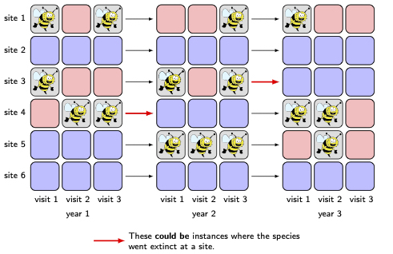
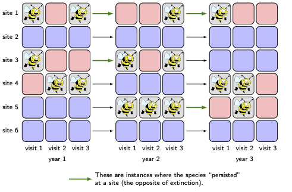
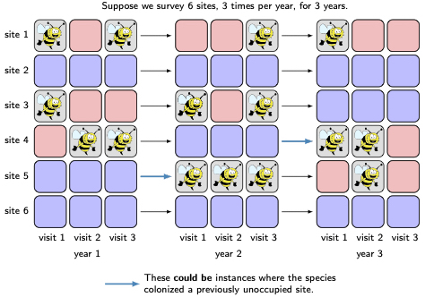

<style>
slides > slide {
  overflow-x: auto !important;
  overflow-y: auto !important;
}
</style>


```{r setup, include=FALSE}
knitr::opts_chunk$set(echo = TRUE,
                      cache = TRUE)
library(nimble)
library(coda)
```

# Workshop organization

- Today's modules 
- 1. Overview of `nimble`, intro to Hidden Markov models, fitting a dynamic occypancy model. 
- 2. `nimbleEcology` distributions for capture-recapture, occupancy, dynamic occupancy

- Bonus modules 
- 1. CJS capture-recapture model with dipper data
- 2. Extending models and methods using `nimbleFunction`s for efficiency and generality. 
- 3. Speeding up spatial capture-recapture (`nimbleSCR`).

- for depper dive into NIMBLE, check out the upcoming 3-day workshop in [Lisbon](https://nimbleworkshop.weebly.com/)

# What Is NIMBLE?
- **N**umerical **I**nference for statistical **M**odels using **B**ayesian and **L**ikelihood **E**stimation.
- A framework for hierarchical statistical models and methods.
- A nearly drop-in alternative to WinBUGS, OpenBUGS and JAGS.
- An extension of the BUGS language for:

    - writing new functions and distributions.
    - named alternative parameterizations (e.g. sd vs precision for `dnorm`).
    - Additional R-like coding, including vectorized declarations.
    
- A configurable system for MCMC.

- A library of other methods.
  - Sequential Monte Carlo (particle filtering)
  - Particle MCMC
  - Monte Carlo Expectation Maximization (maximum likelihood)
  - Reversible jump MCMC for variable selection
  - Special components for Conditional Auto-Regressive (CAR) models (spatial) and Bayesian non-parametric distributions (BNP).

- A model-generic programming system to write new analysis methods using two-stage `nimbleFunction`s.

# Assumptions for this workshop

- You are familiar with the BUGS/JAGS model language.
- You are familiar with occupancy statistical models 
- The emphasis of this workshop is on the `nimble` and`nimbleEcology` 

Hidden Markov models (Intro)
---

Hidden Markov models (HMMs) are a general statistical framework for:

- systems with discrete latent states (usually) and discrete time steps

    * probabilities of transitioning between states at each time step

- discrete observation categories and imperfect observation 
    
    *  probabilities of being observed in one category given the (true) latent state.

- If transition and/or observation probabilities are time-dependent, we call it a "Dynamic HMM" (DHMM).

---

# Hidden Markov models in site occupancy models

- latent states are the presence or absence of a species at discrete spatial locations
- observed states are imperfect because the probability of detection != 1
- repeat samples at a spatial location enable the estimate of the latent states

---

# HMM example: Single species, multi season ("dynamic") occupancy model

- Uses data simulations from Kery and Schaub [Bayesian Population Analysis using WinBUGS]( https://www.sciencedirect.com/book/9780123870209/bayesian-population-analysis-using-winbugs)
- We will parameterize 1) the rates at which species persist in patches in which they already occur and 2) the rates at which species colonize patches in which they don’t occur. Occupancy then emerges as the net outcome of these two processes.

---

#  The data we collect (y)


---

#  Possible extinction 

---

#  Observed persistence

---

#  Possible colonization


---

# Single species multi season occupancy 

$\mbox{logit}(\psi_{i,j+1}) = \phi_{j} * z_{i,k} + \gamma_{j} * (1-z_{i,j})$.

-  $\psi_{i,j}$ is the occupancy probability at the $i^{\mathrm{th}}$ site in the
$j^{\mathrm{th}}$ year.
- $\phi_{j}$ denotes the probability the species persists at a site from years $j$ to $j+1$ (given that $z_{i,j}=1$) 
- $\gamma_{j}$ denotes the probability that site $i$ is colonized in year $j+1$ (given that $z_{i,j}=0$).


---

## Simulate the data 
- There will be 250 sites sampled 3 times per year for 10 years. (Won't this be lovely?)
- data, y: 0 = not-detected, 1 = detected.
- latent states, z: 1 = present, 0 = absent 
- Simulate a time-constant model with 3 different covariates affecting the 3 parameters (phi, gamma, p)  (uses the function from the AHMbook package)

---

```{r sim_dOcc_data} 
set.seed(444)

# simulate a time-constant model with 3 different covariates affecting the 3 parameters (phi, gamma, p)

occ.data <- AHMbook::simDynocc(
  nsites = 250,
  nyears = 10,
  nsurveys = 3,
  mean.psi1 = 0.6, # average occupancy probability in first year
  beta.Xpsi1 = 0, # coefficient of environ covariate in p(initial occupancy).
  range.phi = c(0.7, 0.7), # bounds of uniform distribution from which annual p(persistence) is randomly drawn.
  beta.Xphi = 1, # coefficients of environ covariate in p(persistence).
  range.gamma = c(0.3, 0.3), # bounds of uniform distribution from which annual p(colonization) is randomly drawn.
  beta.Xgamma = 1, # coefficient of environmental covariate in p(colonization).
  range.p = c(0.5, 0.5), # bounds of uniform distribution from which annual p(detection) is randomly drawn.
  beta.Xp = 1, # coefficient of environmental covariate in p(detection).
  show.plot = TRUE)

names(occ.data)
```

---

```{r data_exploration} 
dim(occ.data$z)
head(occ.data$z)
```

---

# Basic nimble workflow


---

```{r dOcc_code}
dOcc_code <- nimbleCode({
  for (site in 1:nsite) {
    for (year in 1:nyear) {
      ## persistence
      logit(phi[site, year]) <- beta[1] + beta[2] * Xphi[site, year]
      ## colonization
      logit(gamma[site, year]) <- beta[3] + beta[4] * Xgamma[site, year]
      ## detection
      for (survey in 1:nsurvey) {
        logit(p[site, year, survey]) <- beta[5] + beta[6] * Xp[site, year, survey]
      }
    }

  }

  ## Ecological submodel: Define state conditional on parameters
  for (site in 1:nsite){
    z[site,1] ~ dbern(psi1)
    for (year in 2:nyear){
      muZ[site, year] <- z[site, year-1]*phi[site, year-1] +
        (1-z[site, year-1])*gamma[site, year-1]
      z[site, year] ~ dbern(muZ[site, year])
    }
    }
  ## Observation model
  for (site in 1:nsite){
    for (survey in 1:nsurvey){
      for (year in 1:nyear){
        muy[site, year, survey] <- z[site, year]*(p[site, year, survey])
        y[site, year, survey] ~ dbern(muy[site, year, survey])
      }
    }
  }
  
    # priors
  psi1 ~ dunif(0, 1)
  for (i in 1:6) {
    beta[i] ~ dnorm(0, 1.0e-2)
  }
  })
```

---

# Setup data, constants, and inits

```{r setupInputs}

## data zs with 0s set to NAs
zs <- apply(occ.data$y, c(1, 3), max, na.rm=TRUE)
zs[zs == 0] <- NA

## initial conditions, NAs where 1s in z, and 1s are where NA
zinits <- zs
zinits[zinits == 1] <- 2
zinits[is.na(zinits)] <- sample(0:1, sum(is.na(zinits)), 
                                replace=TRUE) ## random 1,0 for unobserved
zinits[zinits == 2] <- NA

head(zinits)
head(zs)
```

---

## Compare z an z inits

- Where a species was detected, a 1 is provided in the data. There is no need to set up a sampler to sample this node. This would be wasted computation.
- The same nodes in the inits get an NA because there is no reason to have a initial condition for a node you will not sample
-Where it wasn't detected, NA is provided in the data so nimble knows to sample that note as a latent state 

---

```{r setupInputs2}
## constants

dOcc_constants <- list(nsite = occ.data$nsites,
                  nsurvey = occ.data$nsurveys,
                  nyear = occ.data$nyears)

## data 
dOcc_data <- list(y = aperm(occ.data$y, c(1, 3, 2)), ## sites, years, surveys
                  z = zs,
                  Xphi = occ.data$Xphi,
                  Xgamma = occ.data$Xgamma,
                  Xp = aperm(occ.data$Xp, c(1, 3, 2)))

## initial conditions
dOcc_inits <- list(z = zinits,
                  psi1 = runif(1, 0, 1),
                  beta = runif(6, -2, 2))
```

---

# What are constants? What are data?

### Constants are values needed to define model relationships

- Index starting/ending values like `N`
- Constant indexing vectors for indexing data groupings (site, treatment, individual, time): `beta[ treatment[i] ]`.
- Constants must be provided when creating a model with `nimbleModel`.

### Data represents a flag on the role a node plays in the model

- E.g., data nodes shouldn't be sampled in MCMC.
- Data *values* can be changed.
- Data can be provided when calling `nimbleModel` or later.

### Providing data and constants together.

- Data and constants can be provided together **as `constants`**.
- It would be slightly easier for BUGS/JAGS users to call this "data", but that would blur the concepts.  
- NIMBLE will usually disambiguate data and constants when they are provided together as `constants`.

### What are covariates and other non-parameters/non-observations?

- Covariates/predictors are neither parameters nor data in the sense of the likelihood.
- Covariates/predictors can be provided via `constants` if you don't need to change them (often the case).
- Covariates/predictors can be provided via `data` or `inits` if you want to change them.
  - NIMBLE will not treat them as 'data nodes'.

---

# Create a model

```{r nimbleModel, eval = TRUE, echo = TRUE}
dOcc_model <- nimbleModel(code = dOcc_code,
                          constants = dOcc_constants,
                          data = dOcc_data,     # data can be set later.
                          inits = dOcc_inits  # inits can be set later.
                          )                      
```
```{r nimbleModel_eval}
dOcc_model$initializeInfo()                    
```

---

# Create an MCMC

```{r configureMCMC, eval=TRUE}
dOcc_MCMCconf <- configureMCMC(dOcc_model) # defaults to top-level parameters  
dOcc_MCMC <- buildMCMC(dOcc_MCMCconf)
```

# Compile the model and MCMC

## 3. Compile the model and MCMC

```{r compileNimble, eval = TRUE, echo = TRUE, message = TRUE}
C_dOcc_model <- compileNimble(dOcc_model) # These two lines can be done in one line.
C_dOcc_MCMC <- compileNimble(dOcc_MCMC, project = dOcc_model)
```

## 4. Run the MCMC

```{r runMCMC, eval = TRUE, echo = TRUE, message = TRUE}
samples <- runMCMC(C_dOcc_MCMC, niter = 10000, 
                   samplesAsCodaMCMC = TRUE,
                   nchains=3,
                   nburnin=5000)
# Alternative:
# C_dOcc_MCMC$run(1000)
# samples <- as.matrix(C_dOcc_MCMC$mvSamples)
summary(samples)
plot(samples)
```

# How can I use the model in R?

```{r nimbleModel2, eval = TRUE, echo = FALSE}
# Rebuild the model here for safe knitr behavior
#dOcc_model <- nimbleModel(code = dOcc_code,
#                            constants = dOcc_constants,
#                            data = dOcc_data,     # data can be set later.
#                            inits = dOcc_inits  # inits can be set later.
#                            )                        
# C_dOcc_model <- compileNimble(dOcc_model) 
```

```{r model_demo, eval=TRUE}
class(dOcc_model)[1]  # This is a reference class (S5) object
dOcc_model$gamma           # Look at a model variable,
dOcc_model$y[1:2,, ]        # or part of one.
dOcc_model$isData('gamma') # Query what is data
dOcc_model$getNodeNames()[1:10]  # Query what are the nodes (vertices) in the graph,
dOcc_model$getDependencies("z[1, 3]") # and what depends on what..
dOcc_model$calculate()     # Calculate the entire model. Return sum of log probabilities.
dOcc_model$calculate('z[1, 3]') # Calculate one or more nodes in the model.
dOcc_model$calculate(dOcc_model$getDependencies('z[1, 3]')) # Calculate based on model structure.
dOcc_model$simulate("y", includeData = TRUE) # Simulate new data
head(dOcc_model$y)
dOcc_model$calculate("y")   # Calculate new sum of log probabilities

```

# Differences from NIMBLE to JAGS and/or BUGS

* See our [guide on converting from JAGS to NIMBLE](https://r-nimble.org/quick-guide-for-converting-from-jags-or-bugs-to-nimble)
* Wrap your model code in `nimbleCode({})` directly in R.
* Provide information about missing or empty indices:

   * Use `x[1:n, 1:m]` or
   * `x[,]` with `dimensions = list(x = c(n,m))`.
   * Do not use `x` without brackets (unless it is a scalar).
* Decide how much control you need:

    * `nimbleMCMC` will do everything.
    * `nimbleModel`, `configureMCMC`, `buildMCMC`, `compileNimble` and `runMCMC` give you more control.
    