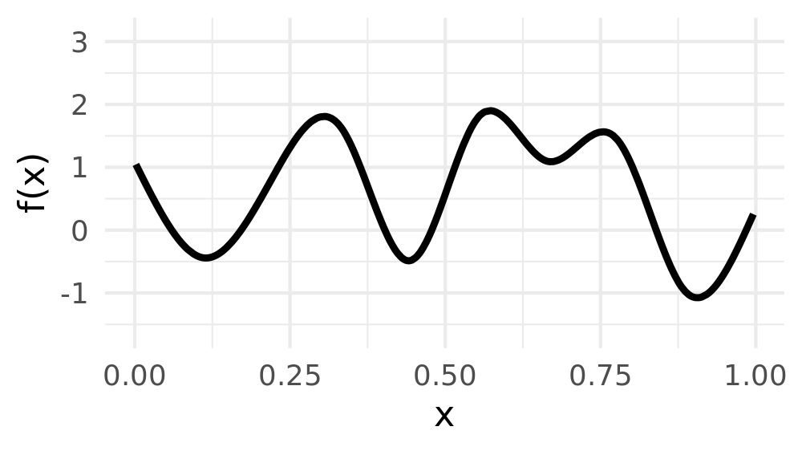
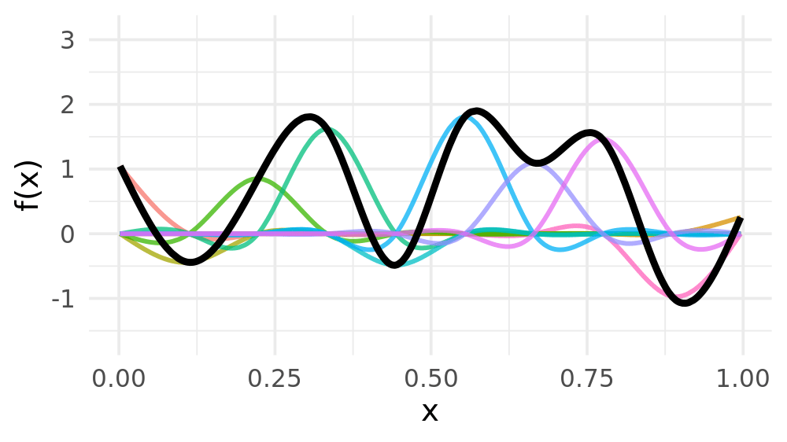
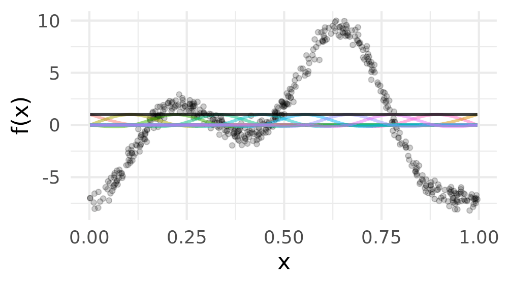
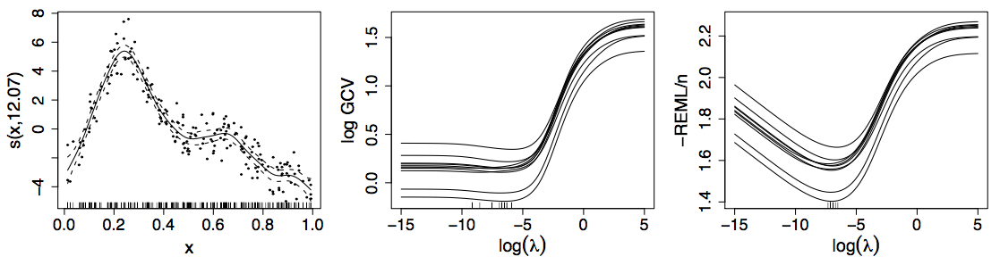

```{r setup, include=FALSE, cache=FALSE}
options(htmltools.dir.version = FALSE)
knitr::opts_chunk$set(cache = TRUE, dev = 'svg', echo = TRUE, message = FALSE, warning = FALSE,
                      fig.height=6, fig.width = 1.777777*6)

library("curl")
library('here')
library('mgcv')
library('gratia')
library('ggplot2')
library('purrr')
library('mvnfast')
library("tibble")
library('gganimate')
library('tidyr')
library("knitr")
library("viridis")
library('readr')
library('dplyr')
library('gganimate')

## plot defaults
theme_set(theme_minimal(base_size = 16, base_family = 'Fira Sans'))

## constants
anim_width <- 1000
anim_height <- anim_width / 1.77777777
anim_dev <- 'png'
anim_res <- 200
```

# Today's topics

* What are GAMs?

* How to fit GAMs in R with **mgcv**

* Examples

---

# Logistics

* HTML Slide deck [bit.ly/gam-efi-22]() &copy; Simpson (2022) [](http://creativecommons.org/licenses/by/4.0/)

* RMarkdown [bit.ly/gam-efi-git](https://bit.ly/gam-efi-git)

---
class: inverse middle center subsection

# Motivating example

---

# HadCRUT4 time series

```{r hadcrut-temp-example, echo = FALSE}
library('readr')
library('dplyr')
## Load Data
tmpf <- tempfile()
curl_download("https://www.metoffice.gov.uk/hadobs/hadcrut4/data/current/time_series/HadCRUT.4.6.0.0.annual_nh.txt", tmpf)
gtemp <- read.table(tmpf, colClasses = rep("numeric", 12))[, 1:2] # only want some of the variables
names(gtemp) <- c("Year", "Temperature")
gtemp <- as_tibble(gtemp)

## Plot
gtemp_plt <- ggplot(gtemp, aes(x = Year, y = Temperature)) +
    geom_line() + 
    geom_point() +
    labs(x = 'Year', y = expression(Temeprature ~ degree*C))
gtemp_plt
```

???

Hadley Centre NH temperature record ensemble

How would you model the trend in these data?

---

# Linear Models

$$y_i \sim \mathcal{N}(\mu_i, \sigma^2)$$

$$\mu_i = \beta_0 + \beta_1 x_{1i} + \beta_2 x_{2i} + \cdots + \beta_j x_{ji}$$

Assumptions

1. linear effects of covariates are good approximation of the true effects
2. conditional on the values of covariates, $y_i | \mathbf{X} \sim \mathcal{N}(0, \sigma^2)$
3. this implies all observations have the same *variance*
4. $y_i | \mathbf{X}$ are *independent*

An **additive** model address the first of these

---
class: inverse center middle subsection

# Why bother with anything more complex?

---

# Is this linear?

```{r hadcrut-temp-example, echo = FALSE}
```

---

# Polynomials perhaps&hellip;

```{r hadcrut-temp-polynomial, echo = FALSE}
p <- c(1,3,8,15)
N <- 300
newd <- with(gtemp, data.frame(Year = seq(min(Year), max(Year), length = N)))
polyFun <- function(i, data = data) {
    lm(Temperature ~ poly(Year, degree = i), data = data)
}
mods <- lapply(p, polyFun, data = gtemp)
pred <- vapply(mods, predict, numeric(N), newdata = newd)
colnames(pred) <- p
newd <- cbind(newd, pred)
polyDat <- gather(newd, Degree, Fitted, - Year)
polyDat <- mutate(polyDat, Degree = ordered(Degree, levels = p))
gtemp_plt + geom_line(data = polyDat, mapping = aes(x = Year, y = Fitted, colour = Degree),
                      size = 1.5, alpha = 0.9) +
    scale_color_brewer(name = "Degree", palette = "PuOr") +
    theme(legend.position = "right")
```

---

# Polynomials perhaps&hellip;

We can keep on adding ever more powers of $\boldsymbol{x}$ to the model &mdash; model selection problem

**Runge phenomenon** &mdash; oscillations at the edges of an interval &mdash; means simply moving to higher-order polynomials doesn't always improve accuracy

---
class: inverse middle center subsection

# GAMs offer a solution

---

# HadCRUT data set

```{r read-hadcrut, echo = TRUE}
## Load Data
tmpf <- tempfile()
curl_download("https://www.metoffice.gov.uk/hadobs/hadcrut4/data/current/time_series/HadCRUT.4.6.0.0.annual_nh.txt", tmpf)
gtemp <- read.table(tmpf, colClasses = rep("numeric", 12))[, 1:2] # only want some of the variables
names(gtemp) <- c("Year", "Temperature")
gtemp <- as_tibble(gtemp)
```

[File format](https://www.metoffice.gov.uk/hadobs/hadcrut4/data/current/series_format.html)

---

# HadCRUT data set

```{r show-hadcrut, echo = TRUE}
gtemp
```

---

# Fitting a GAM

```{r hadcrutemp-fitted-gam, echo = TRUE, results = 'hide'}
library('mgcv')
m <- gam(Temperature ~ s(Year), data = gtemp, method = 'REML')
summary(m)
```

.smaller[
```{r hadcrutemp-fitted-gam, echo = FALSE}
```
]

---

# Fitted GAM

```{r hadcrtemp-plot-gam, echo = FALSE}
N <- 300
newd <- as_tibble(with(gtemp, data.frame(Year = seq(min(Year), max(Year), length = N))))
pred <- as_tibble(as.data.frame(predict(m, newdata = newd, se.fit = TRUE,
                                        unconditional = TRUE)))
pred <- bind_cols(newd, pred) %>%
    mutate(upr = fit + 2 * se.fit, lwr = fit - 2*se.fit)

ggplot(gtemp, aes(x = Year, y = Temperature)) +
    geom_point() +
    geom_ribbon(data = pred,
                mapping = aes(ymin = lwr, ymax = upr, x = Year), alpha = 0.4, inherit.aes = FALSE,
                fill = "#fdb338") +
    geom_line(data = pred,
              mapping = aes(y = fit, x = Year), inherit.aes = FALSE, size = 1, colour = "#025196") +
    labs(x = 'Year', y = expression(Temeprature ~ degree*C))
```

---
class: inverse middle center big-subsection

# GAMs

---

# Generalized Additive Models

<br />


.references[Source: [GAMs in R by Noam Ross](https://noamross.github.io/gams-in-r-course/)]

???

GAMs are an intermediate-complexity model

* can learn from data without needing to be informed by the user
* remain interpretable because we can visualize the fitted features

---

# How is a GAM different?

In LM we model the mean of data as a sum of linear terms:

$$y_i = \beta_0 +\sum_j \color{red}{ \beta_j x_{ji}} +\epsilon_i$$

A GAM is a sum of _smooth functions_ or _smooths_

$$y_i = \beta_0 + \sum_j \color{red}{s_j(x_{ji})} + \epsilon_i$$

where $\epsilon_i \sim N(0, \sigma^2)$, $y_i \sim \text{Normal}$ (for now)

Call the above equation the **linear predictor** in both cases

---

# Fitting a GAM in R

```r
model <- gam(y ~ s(x1) + s(x2) + te(x3, x4), # formuala describing model
             data = my_data_frame,           # your data
             method = 'REML',                # or 'ML'
             family = gaussian)              # or something more exotic
```

`s()` terms are smooths of one or more variables

`te()` terms are the smooth equivalent of *main effects + interactions*

---

# How did `gam()` *know*?

```{r hadcrtemp-plot-gam, echo = FALSE}
```

---
class: inverse
background-image: url('./resources/rob-potter-398564.jpg')
background-size: contain

# What magic is this?

.footnote[
<a style="background-color:black;color:white;text-decoration:none;padding:4px 6px;font-family:-apple-system, BlinkMacSystemFont, &quot;San Francisco&quot;, &quot;Helvetica Neue&quot;, Helvetica, Ubuntu, Roboto, Noto, &quot;Segoe UI&quot;, Arial, sans-serif;font-size:12px;font-weight:bold;line-height:1.2;display:inline-block;border-radius:3px;" href="https://unsplash.com/@robpotter?utm_medium=referral&amp;utm_campaign=photographer-credit&amp;utm_content=creditBadge" target="_blank" rel="noopener noreferrer" title="Download free do whatever you want high-resolution photos from Rob Potter"><span style="display:inline-block;padding:2px 3px;"><svg xmlns="http://www.w3.org/2000/svg" style="height:12px;width:auto;position:relative;vertical-align:middle;top:-1px;fill:white;" viewBox="0 0 32 32"><title></title><path d="M20.8 18.1c0 2.7-2.2 4.8-4.8 4.8s-4.8-2.1-4.8-4.8c0-2.7 2.2-4.8 4.8-4.8 2.7.1 4.8 2.2 4.8 4.8zm11.2-7.4v14.9c0 2.3-1.9 4.3-4.3 4.3h-23.4c-2.4 0-4.3-1.9-4.3-4.3v-15c0-2.3 1.9-4.3 4.3-4.3h3.7l.8-2.3c.4-1.1 1.7-2 2.9-2h8.6c1.2 0 2.5.9 2.9 2l.8 2.4h3.7c2.4 0 4.3 1.9 4.3 4.3zm-8.6 7.5c0-4.1-3.3-7.5-7.5-7.5-4.1 0-7.5 3.4-7.5 7.5s3.3 7.5 7.5 7.5c4.2-.1 7.5-3.4 7.5-7.5z"></path></svg></span><span style="display:inline-block;padding:2px 3px;">Rob Potter</span></a>
]

---
class: inverse
background-image: url('resources/wiggly-things.png')
background-size: contain

???

---

```{r smooth-fun-animation, results = FALSE, echo = FALSE}
f <- function(x) {
    x^11 * (10 * (1 - x))^6 + ((10 * (10 * x)^3) * (1 - x)^10)
}

draw_beta <- function(n, k, mu = 1, sigma = 1) {
    rmvn(n = n, mu = rep(mu, k), sigma = diag(rep(sigma, k)))
}

weight_basis <- function(bf, x, n = 1, k, ...) {
    beta <- draw_beta(n = n, k = k, ...)
    out <- sweep(bf, 2L, beta, '*')
    colnames(out) <- paste0('f', seq_along(beta))
    out <- as_tibble(out)
    out <- add_column(out, x = x)
    out <- pivot_longer(out, -x, names_to = 'bf', values_to = 'y')
    out
}

random_bases <- function(bf, x, draws = 10, k, ...) {
    out <- rerun(draws, weight_basis(bf, x = x, k = k, ...))
    out <- bind_rows(out)
    out <- add_column(out, draw = rep(seq_len(draws), each = length(x) * k),
                      .before = 1L)
    class(out) <- c("random_bases", class(out))
    out
}

plot.random_bases <- function(x, facet = FALSE) {
    plt <- ggplot(x, aes(x = x, y = y, colour = bf)) +
        geom_line(lwd = 1, alpha = 0.75) +
        guides(colour = FALSE)
    if (facet) {
        plt + facet_wrap(~ draw)
    }
    plt
}

normalize <- function(x) {
    rx <- range(x)
    z <- (x - rx[1]) / (rx[2] - rx[1])
    z
}

set.seed(1)
N <- 500
data <- tibble(x     = runif(N),
               ytrue = f(x),
               ycent = ytrue - mean(ytrue),
               yobs  = ycent + rnorm(N, sd = 0.5))

k <- 10
knots <- with(data, list(x = seq(min(x), max(x), length = k)))
sm <- smoothCon(s(x, k = k, bs = "cr"), data = data, knots = knots)[[1]]$X
colnames(sm) <- levs <- paste0("f", seq_len(k))
basis <- pivot_longer(cbind(sm, data), -(x:yobs), names_to = 'bf')
basis

set.seed(2)
bfuns <- random_bases(sm, data$x, draws = 20, k = k)

smooth <- bfuns %>%
    group_by(draw, x) %>%
    summarise(spline = sum(y)) %>%
    ungroup()

p1 <- ggplot(smooth) +
    geom_line(data = smooth, aes(x = x, y = spline), lwd = 1.5) +
    labs(y = 'f(x)', x = 'x') +
    theme_minimal(base_size = 16, base_family = 'Fira Sans')

smooth_funs <- animate(
    p1 + transition_states(draw, transition_length = 4, state_length = 2) + 
    ease_aes('cubic-in-out'),
    nframes = 200, height = anim_height, width = anim_width, res = anim_res, dev = anim_dev)

anim_save('resources/spline-anim.gif', smooth_funs)
```

# Wiggly things

.center[]

???

GAMs use splines to represent the non-linear relationships between covariates, here `x`, and the response variable on the `y` axis.

---

# Basis expansions

In the polynomial models we used a polynomial basis expansion of $\boldsymbol{x}$

* $\boldsymbol{x}^0 = \boldsymbol{1}$ &mdash; the model constant term
* $\boldsymbol{x}^1 = \boldsymbol{x}$ &mdash; linear term
* $\boldsymbol{x}^2$
* $\boldsymbol{x}^3$
* &hellip;

---

# Splines

Splines are *functions* composed of simpler functions

Simpler functions are *basis functions* & the set of basis functions is a *basis*

When we model using splines, each basis function $b_k$ has a coefficient $\beta_k$

Resultant spline is a the sum of these weighted basis functions, evaluated at the values of $x$

$$s(x) = \sum_{k = 1}^K \beta_k b_k(x)$$

---

# Splines formed from basis functions

```{r basis-functions, fig.height=6, fig.width = 1.777777*6, echo = FALSE}
ggplot(basis,
       aes(x = x, y = value, colour = bf)) +
    geom_line(lwd = 2, alpha = 0.5) +
    guides(colour = FALSE) +
    labs(x = 'x', y = 'b(x)') +
    theme_minimal(base_size = 20, base_family = 'Fira Sans')
```

???

Splines are built up from basis functions

Here I'm showing a cubic regression spline basis with 10 knots/functions

We weight each basis function to get a spline. Here all the basisi functions have the same weight so they would fit a horizontal line

---

# Weight basis functions &#8680; spline

```{r basis-function-animation, results = 'hide', echo = FALSE}
bfun_plt <- plot(bfuns) +
    geom_line(data = smooth, aes(x = x, y = spline),
              inherit.aes = FALSE, lwd = 1.5) +
    labs(x = 'x', y = 'f(x)') +
    theme_minimal(base_size = 14, base_family = 'Fira Sans')

bfun_anim <- animate(
    bfun_plt + transition_states(draw, transition_length = 4, state_length = 2) + 
    ease_aes('cubic-in-out'),
    nframes = 200, height = anim_height, width = anim_width, res = anim_res, dev = anim_dev)

anim_save('resources/basis-fun-anim.gif', bfun_anim)
```

.center[]

???

But if we choose different weights we get more wiggly spline

Each of the splines I showed you earlier are all generated from the same basis functions but using different weights

---

# How do GAMs learn from data?

```{r example-data-figure, fig.height=6, fig.width = 1.777777*6, echo = FALSE}
data_plt <- ggplot(data, aes(x = x, y = ycent)) +
    geom_line(col = 'goldenrod', lwd = 2) +
    geom_point(aes(y = yobs), alpha = 0.2, size = 3) +
    labs(x = 'x', y = 'f(x)') +
    theme_minimal(base_size = 20, base_family = 'Fira Sans')
data_plt
```

???

How does this help us learn from data?

Here I'm showing a simulated data set, where the data are drawn from the orange functions, with noise. We want to learn the orange function from the data

---

# Maximise penalised log-likelihood &#8680; &beta;

```{r basis-functions-anim, results = "hide", echo = FALSE}
sm2 <- smoothCon(s(x, k = k, bs = "cr"), data = data, knots = knots)[[1]]$X
beta <- coef(lm(ycent ~ sm2 - 1, data = data))
wtbasis <- sweep(sm2, 2L, beta, FUN = "*")
colnames(wtbasis) <- colnames(sm2) <- paste0("F", seq_len(k))
## create stacked unweighted and weighted basis
basis <- as_tibble(rbind(sm2, wtbasis)) %>%
    add_column(x = rep(data$x, times = 2),
               type = rep(c('unweighted', 'weighted'), each = nrow(sm2)),
               .before = 1L)
##data <- cbind(data, fitted = rowSums(scbasis))
wtbasis <- as_tibble(rbind(sm2, wtbasis)) %>%
    add_column(x      = rep(data$x, times = 2),
               fitted = rowSums(.),
               type   = rep(c('unweighted', 'weighted'), each = nrow(sm2))) %>%
    pivot_longer(-(x:type), names_to = 'bf')
basis <- pivot_longer(basis, -(x:type), names_to = 'bf')

p3 <- ggplot(data, aes(x = x, y = ycent)) +
    geom_point(aes(y = yobs), alpha = 0.2) +
    geom_line(data = basis,
              mapping = aes(x = x, y = value, colour = bf),
              lwd = 1, alpha = 0.5) +
    geom_line(data = wtbasis,
              mapping = aes(x = x, y = fitted), lwd = 1, colour = 'black', alpha = 0.75) +
    guides(colour = FALSE) +
    labs(y = 'f(x)', x = 'x') +
    theme_minimal(base_size = 16, base_family = 'Fira Sans')

crs_fit <- animate(p3 + transition_states(type, transition_length = 4, state_length = 2) + 
                   ease_aes('cubic-in-out'),
                   nframes = 100, height = anim_height, width = anim_width, res = anim_res,
                   dev = anim_dev)

anim_save('./resources/gam-crs-animation.gif', crs_fit)
```

.center[]

???

Fitting a GAM involves finding the weights for the basis functions that produce a spline that fits the data best, subject to some constraints


---
class: inverse middle center subsection

# Avoid overfitting our sample

---
class: inverse center middle large-subsection

# How wiggly?

$$
\int_{\mathbb{R}} [f^{\prime\prime}]^2 dx = \boldsymbol{\beta}^{\mathsf{T}}\mathbf{S}\boldsymbol{\beta}
$$

---
class: inverse center middle large-subsection

# Penalised fit

$$
\mathcal{L}_p(\boldsymbol{\beta}) = \mathcal{L}(\boldsymbol{\beta}) - \frac{1}{2} \lambda\boldsymbol{\beta}^{\mathsf{T}}\mathbf{S}\boldsymbol{\beta}
$$

---

# Wiggliness

$$\int_{\mathbb{R}} [f^{\prime\prime}]^2 dx = \boldsymbol{\beta}^{\mathsf{T}}\mathbf{S}\boldsymbol{\beta} = \large{W}$$

(Wiggliness is 100% the right mathy word)

We penalize wiggliness to avoid overfitting

---

# Making wiggliness matter

$W$ measures **wiggliness**

(log) likelihood measures closeness to the data

We use a **smoothing parameter** $\lambda$ to define the trade-off, to find
the spline coefficients $B_k$ that maximize the **penalized** log-likelihood

$$\mathcal{L}_p = \log(\text{Likelihood})  - \lambda W$$

---

# HadCRUT4 time series

```{r hadcrut-temp-penalty, echo = FALSE}
K <- 40
lambda <- c(10000, 1, 0.01, 0.00001)
N <- 300
newd <- with(gtemp, data.frame(Year = seq(min(Year), max(Year), length = N)))
fits <- lapply(lambda, function(lambda) gam(Temperature ~ s(Year, k = K, sp = lambda), data = gtemp))
pred <- vapply(fits, predict, numeric(N), newdata = newd)
op <- options(scipen = 100)
colnames(pred) <- lambda
newd <- cbind(newd, pred)
lambdaDat <- gather(newd, Lambda, Fitted, - Year)
lambdaDat <- transform(lambdaDat, Lambda = factor(paste("lambda ==", as.character(Lambda)),
                                                  levels = paste("lambda ==", as.character(lambda))))

gtemp_plt + geom_line(data = lambdaDat, mapping = aes(x = Year, y = Fitted, group = Lambda),
                      size = 1, colour = "#e66101") +
    facet_wrap( ~ Lambda, ncol = 2, labeller = label_parsed)
options(op)
```

---

# Picking the right wiggliness

.pull-left[
Two ways to think about how to optimize $\lambda$:

* Predictive: Minimize out-of-sample error
* Bayesian:  Put priors on our basis coefficients
]

.pull-right[
Many methods: AIC, Mallow's $C_p$, GCV, ML, REML

* **Practically**, use **REML**, because of numerical stability
* Hence `gam(..., method = "REML")`
]

.center[

]

---

# Maximum allowed wiggliness

We set **basis complexity** or "size" $k$

This is _maximum wigglyness_, can be thought of as number of small functions that make up a curve

Once smoothing is applied, curves have fewer **effective degrees of freedom (EDF)**

EDF < $k$

---

# Maximum allowed wiggliness

$k$ must be *large enough*, the $\lambda$ penalty does the rest

*Large enough* &mdash; space of functions representable by the basis includes the true function or a close approximation to the tru function

Bigger $k$ increases computational cost

In **mgcv**, default $k$ values are arbitrary &mdash; after choosing the model terms, this is the key user choice

**Must be checked!** &mdash; `gam.check()`


---

# GAM summary so far

1. GAMs give us a framework to model  flexible nonlinear relationships

2. Use little functions (**basis functions**) to make big functions (**smooths**)

3. Use a **penalty** to trade off wiggliness/generality 

4. Need to make sure your smooths are **wiggly enough**

---
class: inverse middle center subsection

# A cornucopia of smooths

---

# A cornucopia of smooths

The type of smoother is controlled by the `bs` argument (think *basis*)

The default is a low-rank thin plate spline `bs = 'tp'`

Many others available

.row[
.col-6[

* Cubic splines `bs = 'cr'`
* P splines `bs = 'ps'`
* Cyclic splines `bs = 'cc'` or `bs = 'cp'`
* Adaptive splines `bs = 'ad'`
* Random effect `bs = 're'`
* Factor smooths `bs = 'fs'`
]
.col-6[

* Duchon splines `bs = 'ds'`
* Spline on the sphere `bs = 'sos'`
* MRFs `bs = 'mrf'`
* Soap-film smooth `bs = 'so'`
* Gaussian process `bs = 'gp'`
]
]

---

# A bestiary of conditional distributions

A GAM is just a fancy GLM

Simon Wood & colleagues (2016) have extended the *mgcv* methods to some non-exponential family distributions

.row[
.col-6[
* `binomial()`
* `poisson()`
* `Gamma()`
* `inverse.gaussian()`
* `nb()`
* `tw()`
* `mvn()`
* `multinom()`
]
.col-6[
* `betar()`
* `scat()`
* `gaulss()`
* `ziplss()`
* `twlss()`
* `cox.ph()`
* `gamals()`
* `ocat()`
]
]

---

# Smooth interactions

Two ways to fit smooth interactions

1. Bivariate (or higher order) thin plate splines
    * `s(x, z, bs = 'tp')`
    * Isotropic; single smoothness parameter for the smooth
	* Sensitive to scales of `x` and `z`
2. Tensor product smooths
    * Separate marginal basis for each smooth, separate smoothness parameters
	* Invariant to scales of `x` and `z`
	* Use for interactions when variables are in different units
	* `te(x, z)`

---

# Tensor product smooths

There are multiple ways to build tensor products in *mgcv*

1. `te(x, z)`
2. `t2(x, z)`
3. `s(x) + s(z) + ti(x, z)`

`te()` is the most general form but not usable in `gamm4::gamm4()` or *brms*

`t2()` is an alternative implementation that does work in `gamm4::gamm4()` or *brms*

`ti()` fits pure smooth interactions; where the main effects of `x` and `z` have been removed from the basis

---

# Factor smooth interactions

Two ways for factor smooth interactions

1. `by` variable smooths
    * entirely separate smooth function for each level of the factor
	* each has it's own smoothness parameter
	* centred (no group means) so include factor as a fixed effect
	* `y ~ f + s(x, by = f)`
2. `bs = 'fs'` basis
    * smooth function for each level of the function
	* share a common smoothness parameter
	* fully penalized; include group means
	* closer to random effects
	* `y ~ s(x, f, bs = 'fs')`

---

# Random effects

When fitted with REML or ML, smooths can be viewed as just fancy random effects

Inverse is true too; random effects can be viewed as smooths

If you have simple random effects you can fit those in `gam()` and `bam()` without needing the more complex GAMM functions `gamm()` or `gamm4::gamm4()`

These two models are equivalent

```{r ranefs}
m_nlme <- lme(travel ~ 1, data = Rail, ~ 1 | Rail, method = "REML") 

m_gam  <- gam(travel ~ s(Rail, bs = "re"), data = Rail, method = "REML")
```

---

# Random effects

The random effect basis `bs = 're'` is not as computationally efficient as *nlme* or *lme4* for fitting

* complex random effects terms, or
* random effects with many levels

Instead see `gamm()` and `gamm4::gamm4()`

* `gamm()` fits using `lme()`
* `gamm4::gamm4()` fits using `lmer()` or `glmer()`

For non Gaussian models use `gamm4::gamm4()`


---

# Next steps

Read Simon Wood's book!

Lots more material on our ESA GAM Workshop site

[https://noamross.github.io/mgcv-esa-workshop/]()

Noam Ross' free GAM Course

<https://noamross.github.io/gams-in-r-course/>

A couple of papers:

.smaller[
1. Simpson, G.L., 2018. Modelling Palaeoecological Time Series Using Generalised Additive Models. Frontiers in Ecology and Evolution 6, 149. https://doi.org/10.3389/fevo.2018.00149
2. Pedersen, E.J., Miller, D.L., Simpson, G.L., Ross, N., 2019. Hierarchical generalized additive models in ecology: an introduction with mgcv. PeerJ 7, e6876. https://doi.org/10.7717/peerj.6876
]

Also see my blog: [www.fromthebottomoftheheap.net](http://www.fromthebottomoftheheap.net)

---

# Acknowledgments

.row[

.col-6[

### Funding

.center[]
]

.col-6[

### Fellow GAM colleagues

David Miller

Eric Pedersen

Noam Ross

]

]

### Slides

* HTML Slide deck [bit.ly/gam-efi-22]() &copy; Simpson (2022) [](http://creativecommons.org/licenses/by/4.0/)
* RMarkdown [bit.ly/gam-efi-git](https://bit.ly/gam-efi-git)

